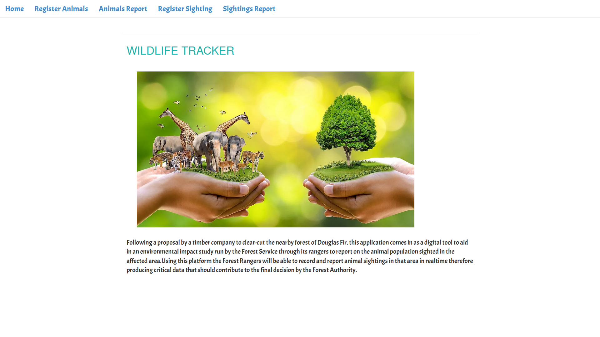

# wildlife-tracker

## Project Description
A java/spark web application that enables Rangers to track wildlife sightings in their area. Following 
a proposal by a timber company to clear-cut the nearby forest of Douglas Fir, this application
comes in as a digital tool to aid in an environmental impact study run by the Forest Service through
its rangers to report on the animal population sighted in the affected area.Using this platform
the Forest Rangers will be able to record and report animal sightings in that area in realtime 
therefore producing critical data that should contribute to the final decision by the Forest Authority.

## Usage/Live Link
Open the following URL in a browser -  

## Setup and Installation
#### Executing the Application
* Download project zip file.
* After extraction open folder in a java IDE.
* Executing App.java should launch the application on your computer's local host.
* Fetch site url from the IDE terminal and open inside browser.

#### Local Database set-up
* Run **psql** to launch postgress command-line-interface
* CREATE DATABASE wildlife_tracker;
* Connect into the database.
  * \c wildlife_tracker;
  * CREATE TABLE animals (id serial PRIMARY KEY, name VARCHAR,type VARCHAR,health VARCHAR, age VARCHAR);
  * CREATE TABLE sightings (ranger VARCHAR, location VARCHAR,animal_id integer);
  * CREATE DATABASE wildlife_tracker_test WITH TEMPLATE wildlife_tracker;
* Other useful commands:
    * SELECT * FROM animals; - View all animal entries.
    * SELECT * FROM sightings; - View all ranger entries.
* \q - disconnect from database.

## Technologies 
* Java - programming language for code logic.
* Spark - framework to build web interface.
* Handlebars - UI templating language.
* Postgress - relational database for application data storage.

## Author
Brian Juma.
 
Contact me via email: njengabrianj@gmail.com